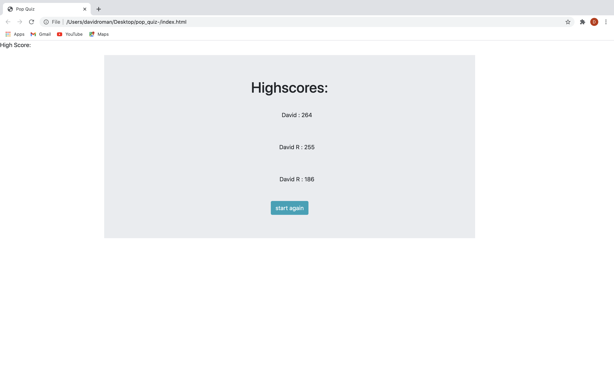

# POP QUIZ 
I build a timed coding quiz with multiple-choice questions using HTML, CSS and Javascript. This features a high score list in the end, buttons that are responsive, a timer with penalty if the user answers incorrect. This application helped me gain familiarity with APIs, what they can do, and how I can use them in my code.

Title page 

Questions 

Completed quiz 

Highscore

